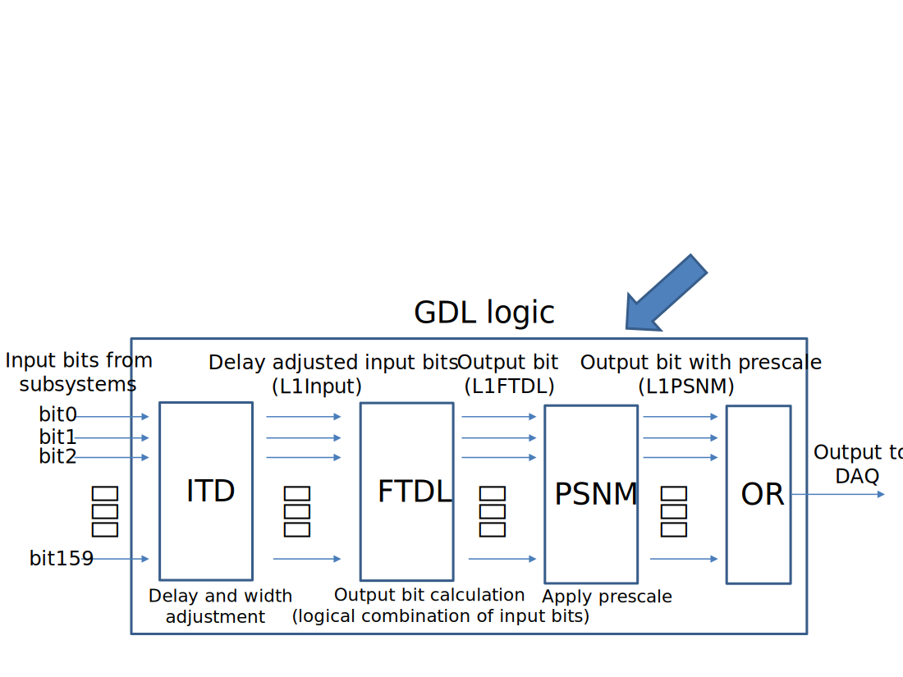

TRG
===

This package contains code relevant for the Level 1 (L1) trigger.

Trigger and TSIM
++++++++++++++++

TSIM (Trigger SIMulation) is a simulation of the L1 trigger system
at Belle II, which is based on several combinations of FPGA based
electric circuits. TSIM simulates the firmware logic on the FPGA with
C++ source code. By default, TSIM is performed event by event (“fast
simulation” mode), and clock by clock behavior is not perfectly
simulated (“full simulation” mode).

.. _trigger_bits:

Trigger Bits
------------

Trigger bits are pre-defined selection criteria implemented in the
trigger system. Thus only 1 (fired) or 0 (not fired) could be assigned
to each trigger bit. Details of the trigger bit definitions could be
found on `the dedicated Confluence page
<https://confluence.desy.de/display/BI/TriggerBitTable>`__
or `the dedicated Belle II notes
<https://docs.belle2.org/search?ln=en&p=%22Trigger+Summary%22&f=&action_search=Search&c=Belle+II+Notes>`__.

There are three kinds of trigger bits: input trigger bits (L1Input),
output trigger bits (L1FTDL), and prescaled trigger bits (L1PSNM). They
are defined inside the global decision logic (GDL), as shown in :numref:`fig:gdl`.
Input trigger bits are predefined selections from each
sub-detector, with adjustment of the delay and width, in order to fix
latency on GDL. For example, ``ty_0`` is one of the input trigger bits
meaning the number of neuro 3D tracks is one. Output bits are the
outputs of GDL, combining different input trigger bits for final
decision. For example, ``yyy`` is one of the output trigger bits meaning
``(ty_2 or ty_3) and !veto``. Prescaled trigger bits are output trigger
bits after prescaling and masking. Sometimes we want to keep only part
of events fired a certain trigger bit, for example, we want to keep only
1% of Bhabha events. A prescale factor of 100 is then assigned to ``bha_3D``
(Bhabha selected in 3D criteria). If at least one of the prescaled
output bits is fired in an event, the event is triggered.

It is recommended to use prescaled trigger bits (L1PSNM) or un-prescaled
trigger bits (L1FTDL) for your analysis. The different prescales are set
to the different output trigger bits in each run. In run-independent MC,
configuration of the prescales in TSIM can be different from data, so L1
FTDL is recommended. In run-dependent MC, configuration of the prescales
in TSIM is consistent with data, so L1PSNM is recommended.

.. tip::
   In the analysis package we provide all the necessary variables for storing
   the L1Input, L1FTDL and L1PSNM information, please see :ref:`trigger variables
   documentation <variables_trigger>`. Note that it is possible to store the
   L1 information using the trigger bit name (e.g.: ``L1PSNM(yyy)`` recommended)
   or the trigger bit number (deprecated, since the trigger bit number may change
   across different data taking periods).

.. warning::
   In different experiments, the trigger bits menu could be different,
   depending on the contents of the global tag. This global tag is
   available when producing the signal MC samples corresponding to a
   particular trigger configuration. However, some testing trigger bits
   might be limited in TSIM. The missing (not valid) trigger bits in TSIM
   could be found on `this Confluence page
   <https://confluence.desy.de/display/BI/Invalid+trigger+bits>`__.

.. _fig:gdl:

    Simplified view of the L1 system and GDL logic.

Efficiency of a certain trigger bit
~~~~~~~~~~~~~~~~~~~~~~~~~~~~~~~~~~~

In most hadronic processes, i.e. BB-bar, the trigger efficiency is very
close to 100%. Trigger bits for specific low multiplicity processes are
also designed, for example, ``lml1``, ..., ``lml16``, ``ecltaub2b``, etc. It is recommended
to check the trigger efficiencies for those trigger bits if you are
working on those processes, and discuss with the experts/trigger
performance group if your work needs understanding of the trigger
efficiency.

With MC, trigger efficiency of a certain trigger bit (``ffy`` for example )
can be calculated as follows:

:math:`\epsilon = \frac{N_\text{ffy}}{N_\text{all}}`

where :math:`N_\text{all}` is the number of all generated events, and :math:`N_\text{ffy}`
is the number of ``ffy`` satisfied events. This efficiency is called “true trigger efficiency”.

On the other hand, with data, we do not know the number of generated
events, because only L1 passed events are recorded on data. One general
way to solve this problem is to use a reference trigger bit, which is
independent from the interested trigger bits. For example, to calculate
the efficiency of a CDC trigger bit like ``ffy`` (``(ty_2 or ty_3) and !veto``),
the ECL trigger bits, like ``hie`` (``ehigh and !bha_veto and !veto``) and ``c4``
(``clst>3 and !bha_veto and !veto``), can be used as the reference:

:math:`\epsilon_\text{exp} = \frac{N_\text{fff} \: \text{and} \: (N_\text{hie} \: \text{or} \: N_\text{c4})}{ N_\text{hie} \: \text{or} \: N_\text{c4}}`

It is recommended to evaluate the differences between data and MC of the trigger efficiency with this method,
and apply correction and systematics to the true trigger efficiency.

.. tip::
   Normally ECL trigger bits will be chosen as the reference to CDC trigger bits, and vice versa.

.. warning::
   In this method with the reference bit, phase space of the signal can be affected
   by the reference trigger bit condition. It is important to check the kinematic dependency of the efficiency.

.. tip::
   For details of the trigger efficiency estimation and validation,
   please refer to the `trigger performance group
   <https://confluence.desy.de/display/BI/Trigger+performance>`__.

Functions in ``L1trigger.py``
+++++++++++++++++++++++++++++

It's not necessary for average users to call any of the functions listed
here. Default behavior is enough for analysts.

.. automodule:: L1trigger
   :members:
   :undoc-members:
